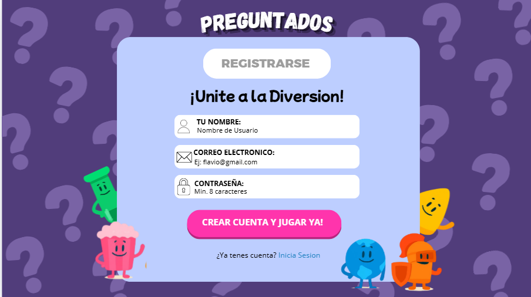
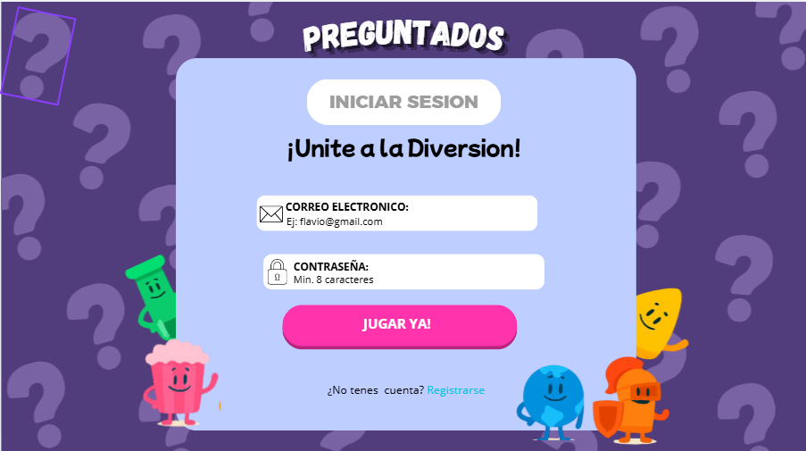
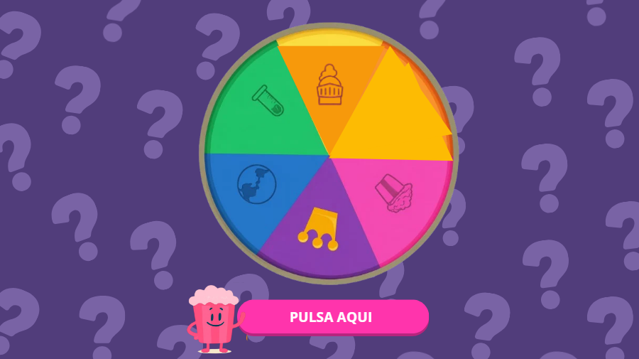
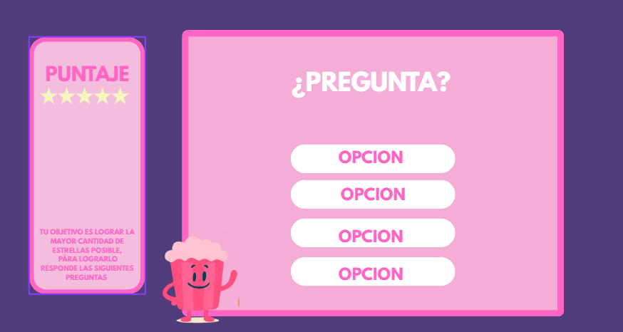
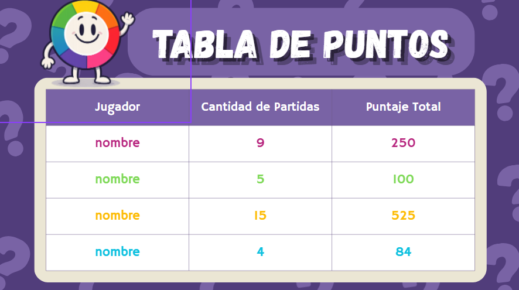

# TP_N1_07
Trabajo integrador mitad de año
# PREGUNTADOS:
## Caracteristicas del juego:
* **La Ruleta Clásica:** Gira el disco para conseguir de forma aleatoria una de las 6 categorías icónicas: **Geografía**, **Ciencia**, **Bonus**, **Arte**, **Deporte** o **Historia**.
* **Algoritmo de No-Repetición:** Al igual que en el juego original, no puedes repetir categorías que ya completaste o en las que te equivocaste durante la ronda actual. Si la ruleta cae en una sección bloqueada, detecta el conflicto y vuelve a girar de forma automática.
* **Registro y Autenticación:** Los usuarios pueden crear su cuenta o iniciar sesión. El juego diferencia entre:
  * **Jugadores:** Quienes compiten, acumulan puntos en la base de datos y escalan en la tabla de posiciones.
  * **Administradores:** Con acceso exclusivo a la gestión del juego.
* **Panel de Control (Admin):** Interfaz completa para crear, editar y eliminar preguntas o respuestas de la base de datos (CRUD completo).
* **Tabla de Posiciones:** Visualiza los puntajes acumulados de todos los jugadores directamente desde la base de datos.

## ¿Que herramientas utilizamos?:
* **Frontend:** HTML5, CSS3 (Animaciones y transiciones nativas para el giro de la ruleta) y JavaScript 
* **Backend:** Node.js con Express (Arquitectura REST API para dar soporte al juego y al panel de administración).
* **Base de Datos:** MySQL.

## Imagenes de la Interfaz:

